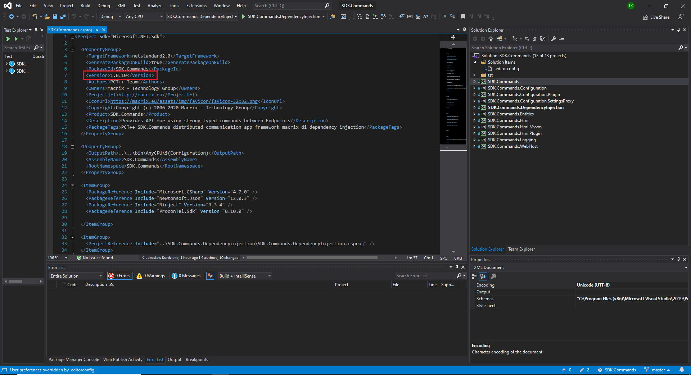
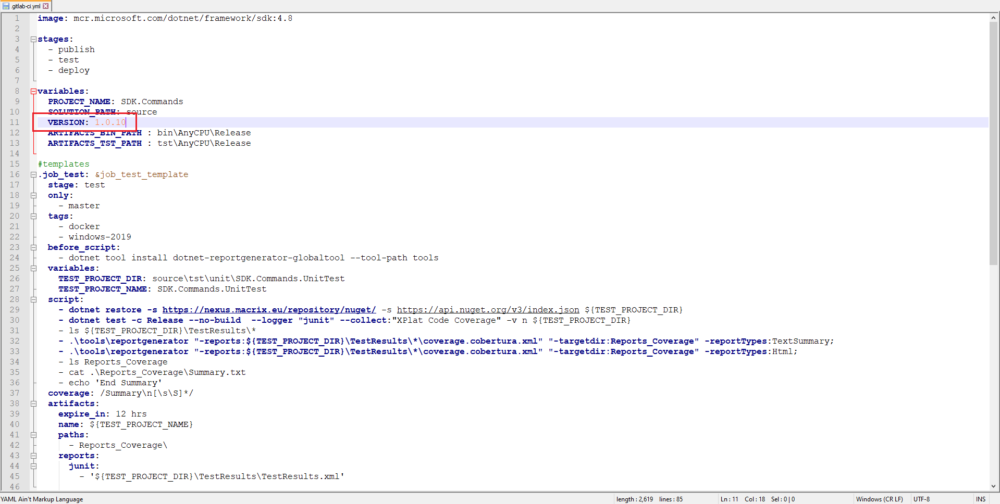
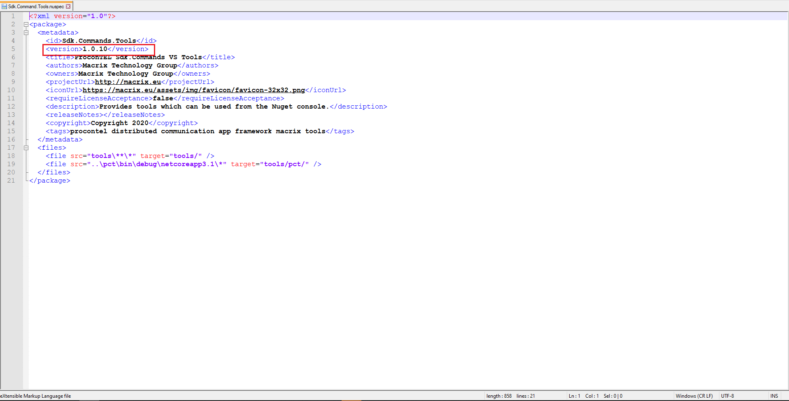

# Release cycle

## Tag patterns
Following tag paatterns are available and recognized by CI\CD:
```
SDK.Commands_*.*.*.*
SDK.Commands.Tools_*.*.*.*
```

## Release SDK.Commands

1. Pull branches `master` and `develop`
2. Checkout into `develop` branch
3. Merge branch `master` into `develop`
4. Change version in all projects from solution .\source\SDK.Commands.sln

5. Change version in file .\.gitlab-ci.yml

6. Merge `develop` into `master` and in merge commit: 
	- add tags `SDK.Commands_*.*.*.*`
7. Push master branch with tags 
8. Check SDK.Commands.* availability on [Nexus repository](https://nexus.macrix.eu/#browse/browse:nuget).

## Release version Sdk.Commands.Tools

1. Pull branches `master` and `develop`
2. Checkout into `develop` branch
3. Merge branch `master` into `develop`
4. Build solution .\tools\Sdk.Commands.Tools\Sdk.Commands.Tools.sln in debug mode
5. Change version in file .\tools\Sdk.Commands.Tools\package\Sdk.Command.Tools.nuspec

6. Go to location .\tools\Sdk.Commands.Tools\package\
7. Run command 
```nuget pack```
[Hint]: Install nuget tool
8. Check Sdk.Commands.Tools.*.*.*.nupkg availability in location .\tools\Sdk.Commands.Tools\package\
9. Push nuget package to https://nexus.macrix.eu/repository/nuget/
```nuget push Sdk.Commands.Tools.*.*.*.nupkg _SUPER_SECRET_KEY_ -Source https://nexus.macrix.eu/repository/nuget/```
10. Check SDK.Commands availability on [Nexus repository](https://nexus.macrix.eu/#browse/browse:nuget).
11. Merge `develop` into `master` and in merge commit: 
	- add tags `SDK.Commands.Tools_*.*.*.*`
12. Push master branch with tags 

